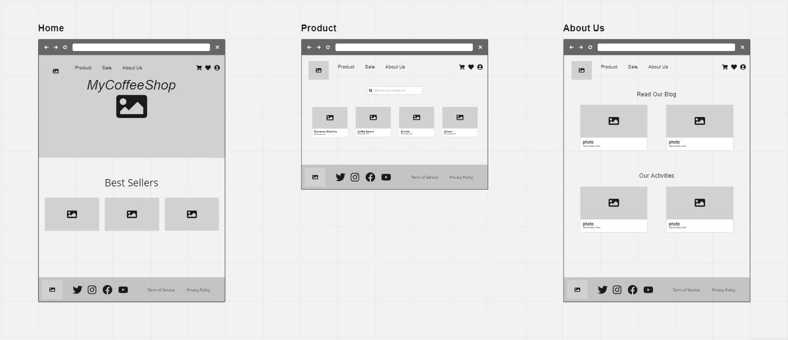
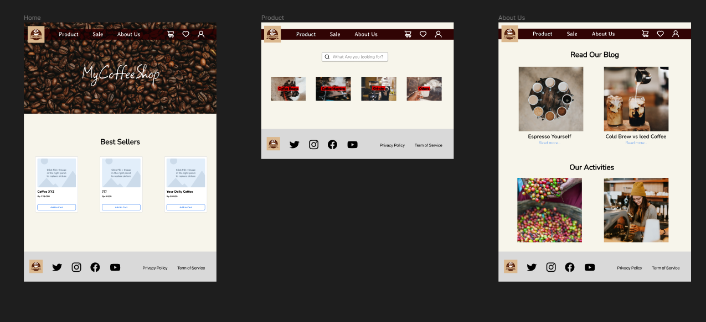

# UI UX

> Assignment for "UI UX".

## Links/URLs:

- https://miro.com/app/board/uXjVPugBnhI=/?share_link_id=440625732838
- https://www.figma.com/file/K7YdB7H0CX9weqXq7toNIV/FSSE-Assignment-W2?node-id=0%3A1&t=cYGIgCX7XscaL6Vi-1

## Inspirations

- https://dribbble.com/
- https://colorhunt.co/
- https://unsplash.com/
- https://www.freepik.com/
- https://www.tokopedia.com/
- https://www.shopify.com/
- https://www.prodirectsport.com/
- http://www.coffeeshop.co.id/

## Screenshots

### Miro (Wireframe)

### Figma (Mockup and Prototyping)

